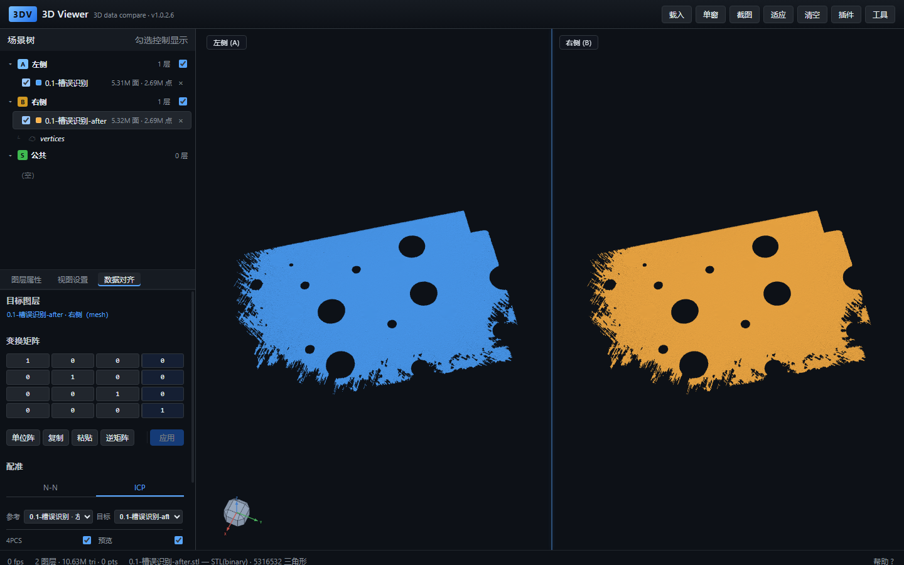
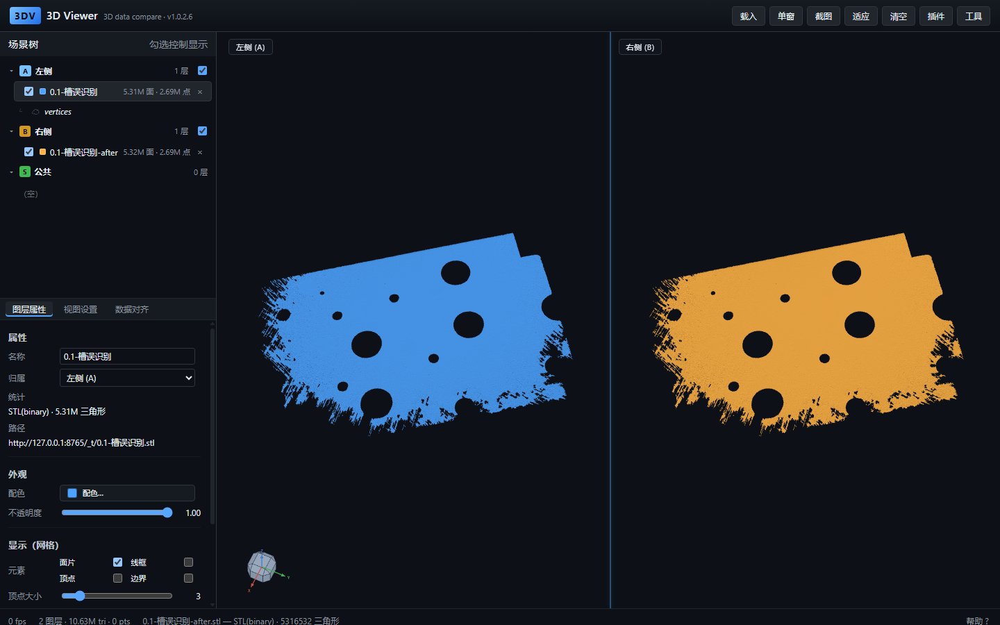

# 3D Viewer

> 零依赖的 WebGL2 三维查看器，用于网格与点云的双窗并排对比。无需构建，开箱即用。


纯原生 JavaScript + WebGL2 实现，没有框架、没有打包步骤、没有 npm 依赖。双击 `serve.bat` 即可在浏览器中打开——**推荐用这个方式**，配准走独立线程、路径载入与孔位优化都可用；直接双击 `index.html` 也能看模型，但功能有缺口（见[两种打开方式](#两种打开方式推荐-servebat)）。

---

## 核心：两份数据并排对比

这是工具的出发点——**左窗放一份、右窗放一份，同屏对照**。

上图左窗是优化前的网格（531 万三角形，蓝），右窗是同一工件优化后的结果（532 万三角形，橙）。两版几何几乎一致，差别集中在槽位——右侧把误识别的槽修正了。整件看不出差别，放大到槽口才分得清；两侧相机同步，转任意角度都保持同一视角。

能对比的组合不限于网格与点云：

| 左窗 | 右窗 | 典型用途 |
|---|---|---|
| 网格 | 网格 | 优化前后两版结果（上图） |
| 网格 | 点云 | 扫描结果 vs CAD 模型，判断偏差 |
| 点云 | 点云 | 两次扫描的形变 |
| 任意 | 任意 | 两个工件的并列查看 |

两侧视口可以**独立相机**（各转各的），也可以**同步相机**（严格同角度），还可以把一侧作为半透明叠加层投到另一侧。

### 两种数据对不上时：数据对齐



扫描件与 CAD 模型往往不在同一姿态。侧栏「数据对齐」提供三种手段：

- **N-N**：在两层上各点若干对应点，实时显示 RMS 与逐点残差，凑够 3 对即可求刚体变换
- **ICP**：局部精配准；姿态差大时先勾选 `4PCS` 做全局粗配准
- **矩阵**：直接编辑 4×4 矩阵并应用，也可取逆矩阵回退

配准结果写入目标图层的顶点数据，可以接着做裁剪、测量或导出。

**用 URL 直接复现这两种布局**：

```
# 双窗并排，且相机同步
index.html?sync=1&url=model.stl&slot=A&url2=model_points.xyz&slot2=B

# 同屏叠加（单窗）
index.html?single=1&url=model.stl&slot=A&url2=model_points.xyz&slot2=B
```

| 参数 | 说明 |
|---|---|
| `url` / `slot` | 第一个文件与槽位（`A` 左 / `B` 右 / `BOTH` 两侧） |
| `url2` / `slot2` | 第二个文件与槽位，两个文件**串行加载**，互不覆盖 |
| `single` | `1` = 单窗口（所有图层在同一视口） |
| `sync` | `1` = 双窗共享相机，左右严格同角度 |
| `zoom` | 相机距离倍数，`< 1` 为放大，用于看局部细节 |
| `target` | `x,y,z`，镜头对准的坐标，配合 `zoom` 定点放大 |

---

## 特性

| | |
|---|---|
| **双窗并排** | 左右两个独立视口各放一份数据，相机可独立或同步；支持把一侧作半透明叠加层投到另一侧 |
| **多格式** | STL（binary / ASCII）、OBJ、PLY、OFF、GLB / glTF、PCD（ascii / binary）、点云文本（xyz / csv / txt / pts …） |
| **三维裁剪** | 矩形 / 多边形框选，空格连续追加选区，一次拆成「选中」与「剩余」两个图层 |
| **孔径测量** | 点击拾取点位，实时计算两点距离 |
| **数据对齐** | N-N 手动选点配准（三维序号标记 + 实时 RMS）、ICP 精配准（可选 4PCS 全局粗配准）、4×4 矩阵直接编辑与取逆 |
| **孔位优化** | 可选插件，调用本地 `HoleOptimize_cli.exe` 计算最优孔位，结果作为子图层回填 |
| **标量场着色** | 点云按字段着色，带色标条与分布直方图 |
| **深浅主题** | 深色 / 浅色一键切换，画布、网格线、浮层同步 |


---

## 快速开始

### Windows

```bat
双击 serve.bat
```

浏览器自动打开 `http://127.0.0.1:8765/`。

### 手动启动

```bash
python server/serve.py
```

可选环境变量：

| 变量 | 默认 | 说明 |
|---|---|---|
| `VIEWER_PORT` | `8765` | 本地服务端口 |
| `VIEWER_NOBROWSER` | — | 设为 `1` 则不自动打开浏览器 |

### 两种打开方式：推荐 `serve.bat`

界面也可以直接双击 `index.html` 打开，但**功能并不等价**：

| 功能 | 双击 `serve.bat`（http） | 双击 `index.html`（`file://`） |
|---|---|---|
| 载入、渲染、视角、拾取、测量、裁剪、导出 | ✅ | ✅ |
| 数据对齐（N-N / ICP / 4PCS） | ✅ | ✅ 但只能在主线程算 |
| **配准期间拖动视角** | ✅ 计算在独立线程，主线程约 17 ms/帧 | ⚠️ 回退主线程，按分片推进，约 34 ms 一顿 |
| 孔位优化 | ✅ 与页面同源，双击即用 | ⚠️ 需另跑 `server/start_bridge.bat`（8790 端口） |
| 属性面板显示文件绝对路径 | ✅ 走 `/locate` | ⚠️ 同上，需 `start_bridge.bat` |
| `?url=` 用相对路径载入 | ✅ 走 `/file?path=` | ❌ 浏览器禁止 `fetch` 本地文件 |
| 「载入历史」按路径重开 | ✅ | ❌ 条目还在，但点不开 |
| 需要 Python | ✅ | ❌ 纯静态 |

原因（实测，不是兼容性玄学）：

```
new Worker('js/icp_worker.js')
  → SecurityError: Script at 'file:///…' cannot be accessed from origin 'null'
fetch('js/core.js')
  → TypeError: Failed to fetch
```

浏览器只在 `http(s)` 源下允许创建 `Worker`，也禁止 `file://` 页面 `fetch` 本地文件。
`file://` 下界面看起来完全正常（状态栏"就绪"、模型正常渲染），失败都是**静默降级**：
Worker 创建失败会被捕获并回退主线程，所以只是变慢、不报错——容易被误判成"配准怎么有点卡"。

> **推荐 `serve.bat`**：一条命令同时得到「静态页面 + `/file` 路径载入 + `/locate` 路径反查 + `/optimize` 孔位优化 + 独立计算线程」，不需要额外启动任何东西。
> 只有「把工具发给别人、对方没装 Python」时才建议直接双击 `index.html`。

### 加载数据

三种方式任选：

1. 顶栏 **载入** → 选择文件
2. 把文件**拖到窗口**里
3. URL 直达：`index.html?url=<相对路径>&slot=B`

**载入菜单里保留最近 10 个**，点一下即可重开，不用再翻目录。

浏览器出于安全不会把文件的真实路径交给网页，所以「重开」不依赖路径，而是三种手段：

| 来源 | 记住什么 | 重开方式 |
|---|---|---|
| 拖入 / 选择（Chrome、Edge） | **文件句柄**（`FileSystemFileHandle`，存在 IndexedDB） | 直接读回同一个文件，任意目录都行，不靠猜 |
| 拖入 / 选择（其它浏览器） | 服务按「文件名 + 大小」反查的绝对路径 | `GET /file?path=` 回读 |
| `?url=` 载入 | 完整地址 | 直接再取 |

句柄是一条真实引用，不是路径字符串——所以桌面、U 盘、网络盘里的文件都能重开，
代价是每次会话首次打开时浏览器会问一次「是否允许读取该文件」。

三种都拿不到的条目会置灰标注「需重新选择」，不会留一个点了没反应的死条目。

---

## 支持格式

| 类型 | 扩展名 | 说明 |
|---|---|---|
| 三角网格 | `.stl` | binary / ASCII；STL 无共享顶点信息，加载时按坐标去重（约省 80% 顶点） |
| 三角网格 | `.obj` | 保留原始 `v` / `f` 拓扑，不做顶点合并 |
| 三角网格 | `.ply` | ASCII / binary |
| 三角网格 | `.off` / `.coff` | 任意边形按扇形三角化；COFF 读取顶点色 |
| 三角网格 | `.glb` / `.gltf` | glTF 2.0；GLB 自包含，`.gltf` 需内联 `data:` buffer；自动把 Y 轴向上转成 Z 轴向上 |
| 点云 | `.pcd` | ascii / binary；读取 `rgb` 字段并解包成顶点色 |
| 点云 | `.xyz` `.csv` `.txt` | 空白或逗号分隔，支持额外标量列 |

超过内存预算时会在加载前弹窗确认，可选择按比例下采样。

---

## 导出

顶栏「导出」（快捷键 `Shift+S`）按**当前选中图层**决定可用项，用不了的项会置灰并说明原因。

| 项 | 适用 | 说明 |
|---|---|---|
| 原始文件 | 任意 | 载入时的原始字节，未经任何处理 |
| STL（binary） | 网格 | 面法向由叉积现算，不依赖源数据 |
| OBJ | 网格 | 复用载入时算好的唯一顶点表，顶点数不会翻倍 |
| PLY | 网格 / 点云 | binary；网格带面表，点云带颜色与标量 |
| GLB | 网格 | glTF 2.0 单文件，自动转成 Y 轴向上 |
| 点云 CSV / XYZ | 点云 | 有标量场时按列追加 |

导出**只反映当前内存中的数据**：经过矩阵应用、裁剪拆分后的图层，导出的是处理结果，
需要原始字节请用「原始文件」（它始终是载入时的那一份）。

大文件按块拼接 Blob，几百万三角形也不会出现一次性字符串拼接导致的内存峰值。

---

## 界面

```
┌──────────────────────────────────────────────────────────┐
│ 3DV  3D Viewer                        载入 双窗 截图 清空  │
├────────────┬─────────────────────────────────────────────┤
│ 场景树      │                                             │
│  A 左侧     │                                             │
│  B 右侧     │              视口（单窗 / 双窗）             │
│  S 公共     │                                             │
├────────────┤                                             │
│ 图层属性    │                                             │
│ 视图设置    │                                             │
│ 数据对齐    │                                             │
└────────────┴─────────────────────────────────────────────┘
```

**槽位含义**：`A` 左侧、`B` 右侧、`S` 公共（两侧同时显示）。图层可在槽位间移动或拷贝，移动后可作为对面模型的半透明叠加层（ghost）。

**场景树**：支持父子层级。网格加载后显示 `72.7k 面 · 38.4k 点`；选中网格后其下方出现 `vertices` 子项，点击查看顶点数与包围盒，右键可把顶点拷成点云图层。

**侧栏**：可左右拖拽调宽（220~620px）；场景树与下方属性区之间可上下拖拽，各自独立滚动。
下方三个标签页（图层属性 / 视图设置 / 数据对齐）共用一套排版：分组标题、行高、标签左对齐、勾选框右对齐。

双窗模式下的完整界面：



---

## 常用操作

### 鼠标

| 操作 | 功能 |
|---|---|
| 左键拖拽 | 旋转 |
| 中键 / 右键拖拽 | 平移 |
| 滚轮 | 缩放 |
| `Ctrl` + 左键 | 点击模型表面设为旋转中心 |
| 单击图层 | 选中，属性面板显示详情 |
| 双击图层 | 视角聚焦到该图层 |

### 键盘

| 按键 | 功能 |
|---|---|
| `f` | 视角适应全部 |
| `w` | 切换选中网格的线框 |
| `n` | 切换法向显示 |
| `p` | 显示 / 隐藏拾取信息 |
| `F2` | 重命名选中图层（也可双击图层名） |
| `Delete` | 删除选中图层 |
| `空格` | 裁剪模式下：保留当前高亮，继续框选下一块 |
| `Ctrl` + `Z` | 撤销上一次追加的选区 |
| `Esc` | 退出裁剪 / 取消当前操作 |

### 三维裁剪流程

```
工具 ▾ → 裁剪
   ↓
框选（矩形 / 多边形）→ 高亮显示选中部分
   ↓
空格 或「继续裁剪」→ 保留高亮，追加下一块（可重复）
   ↓
应用裁剪 → 拆成 _segmented / _remaining 两个图层，退出裁剪
```

裁剪产生的两个图层是完整的几何体，可继续参与后续裁剪或优化。

---

## 孔位优化（可选）

需要本地编译好的 `HoleOptimize_cli.exe`。插件通过 `POST /optimize` 调用它，结果作为子图层挂到源网格下。

`server/bridge.py` 按以下顺序定位 exe：

1. 环境变量 `HOLEOPT_EXE`
2. `<项目根>/HoleOptimize/build/Release/HoleOptimize_cli.exe`
3. `<项目根>/HoleOptimize/build/Debug/HoleOptimize_cli.exe`

自检：

```bash
curl http://127.0.0.1:8765/health
```

返回中的 `exe` 与 `exists` 会明确告诉你 exe 在哪、是否存在。

没有该 exe 时，其余功能不受影响。

---

## 大文件与内存

加载前按文件大小预估内存占用，超出预算会弹窗：

| 选项 | 行为 |
|---|---|
| 取消 | 不加载 |
| 下采样 | 按比例抽样三角形 / 点，并在状态栏标注“已抽样” |
| 强制加载 | 忽略预算（显存不足时 GL 会拒绝并给出提示） |

调试参数：`?memlimit=<MB>`、`?maxpts=<N>`、`?maxtri=<N>`。

---

## 目录结构

```
3DViewer/
├── index.html            单页入口
├── serve.bat             一键启动（静态服务 + 优化桥接）
├── check.ps1             冒烟测试（7 个场景）
├── css/style.css         深浅两套主题变量
├── js/
│   ├── core.js           数学（向量 / 矩阵 / 四元数 / 包围盒）+ KD 树
│   ├── io.js             STL / OBJ / PLY / 点云解析、内存预检
│   ├── algo.js           三角求交、拾取、裁剪、分块索引 + ICP + Super4PCS
│   ├── render.js         WebGL2 渲染、分块、视角器
│   ├── ui.js             场景树、属性面板、数据对齐面板、日志、拖拽 + 纯工具函数
│   ├── app.js            应用编排、图层与相机
│   └── plugins/          插件（孔位优化）
├── server/
│   ├── serve.py          静态服务 + /health /optimize
│   ├── bridge.py         调用本地 exe 的桥接
│   └── start_bridge.bat  独立桥接（file:// 打开时用）
└── docs/
    ├── GUIDE.md          完整开发文档
    └── images/           README 配图
```

**分层约定**：`core` / `io` / `algo` 不接触 DOM 和 WebGL，`render` 只管绘制，`ui` 只管界面，`app` 负责编排。下层通过 hooks 向上层通报，不反向依赖。

---

## 文档

- **[完整开发文档](docs/GUIDE.md)** — API 细节、算法说明、调试参数、工程约定

---

## 环境要求

| 项 | 要求 |
|---|---|
| 浏览器 | 支持 WebGL2（Chrome 90+ / Edge 90+ / Firefox 90+ / Safari 15+） |
| Python | 3.8+（仅用于启动本地服务，非必需——也可用任意静态服务器） |
| 构建工具 | **不需要** |

> 直接双击 `index.html` 用 `file://` 打开也能查看模型，但配准只能跑在主线程、`?url=` 与「载入历史」不可用；
> 孔位优化与路径反查需额外启动 `server/start_bridge.bat`。
> **推荐始终用 `serve.bat`** —— 两种方式的完整对照见「[两种打开方式](#两种打开方式推荐-servebat)」。

---

## License

[MIT](LICENSE) © 2026 WooChi
